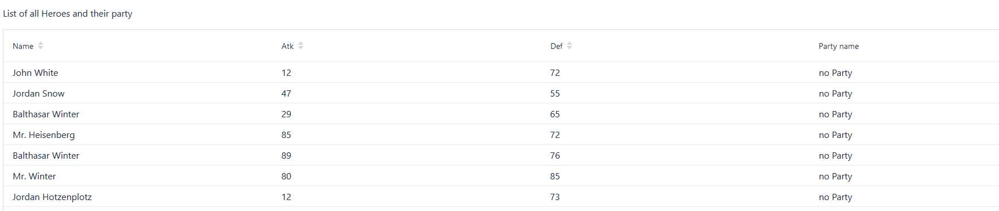
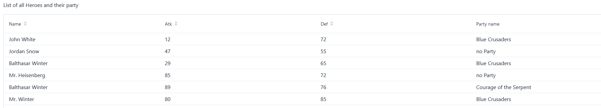
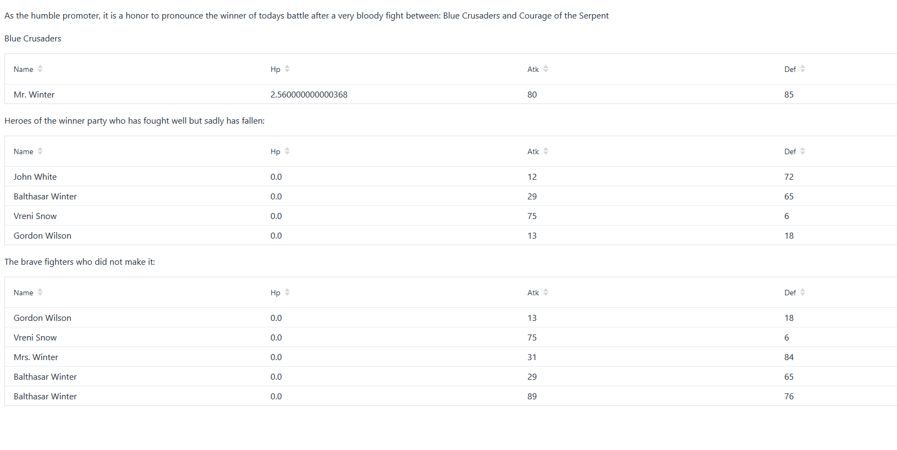
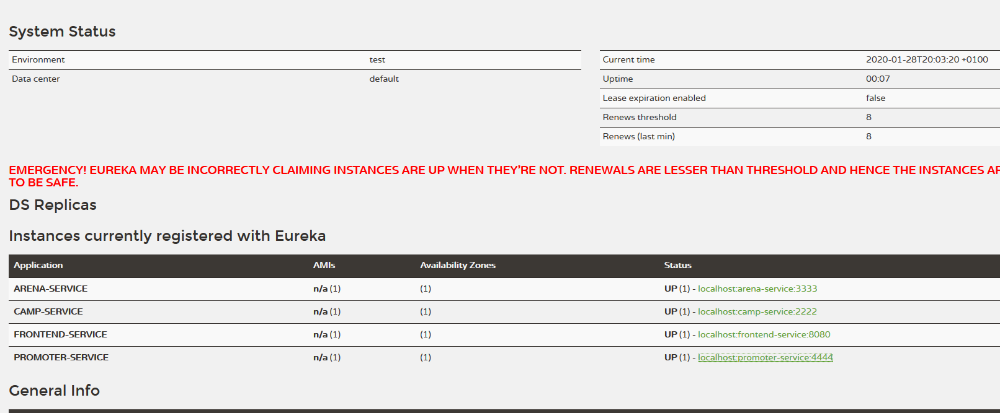

# Java Open Source Project

## Resources

- POM Multimodule: https://www.mkyong.com/maven/maven-how-to-create-a-multi-module-project/
- Spring Initializr: https://start.spring.io/


## Schwierigkeiten im Projekt

### Teamwork

Die erste Schwierigkeit in diesem Projekt war die Rollenverteilung. Wer macht was, wie machen wir es etc. Wir haben uns dann entschieden, dass jeweils eine Aufgabe von einer Person gemacht wird. Anfangs hat das gut funktioniert, doch dann hat ein Gruppenmitglied nicht mehr das gemacht was er eigentlich gesagt hat oder zu spät und es wurde schon von den anderen beiden erledigt. Diese Person hat danach die Gruppe verlassen, da wir gesagt haben, wir werden ihn nicht mittragen solange er nichts macht. Danach hat die Teamarbeit gut funktioniert, die Kommunikation hätte eventuell ein wenig besser sein können, dennoch haben wir das Projekt zusammen aufgleisen können.

### Projekt

Eine weitere Schwierigkeit war es das Projekt richtig aufzubauen. Zuerst war die Projektstruktur nicht gut aufgebaut und somit hat Maven und Spring Boot nicht funktionieren wollen. Zusätzlich gab es Probleme mit der IDE, vor allem mit Eclipse. Daher haben wir uns entschieden Tabula Rasa zu machen und alles nochmal anhand der oben erwähnten Quelle aufzubauen.

Während dem entwickeln hatten wir ein wenig Mühe, das Ganze zu verstehen und auch korrekt umzusetzen. Zum Teil haben im
Skript auch wichtige Informationen gefehlt, die dann entweder durch Googeln oder durch Betrachten der Lösungen ermittelt
werden mussten. Vaadin hat auch einige Schwierigkeiten bereitet, vorallem mit der Request und der Anpassung der battle Methode. Die Seite localhost:4444/promoter/promoteFight macht seit der Einführung von Spring Cloud Probleme mit der Darstellung und wirft Exception, wenn der Promoter zu früh gestartet wird. Zurzeit gibt es Schwierigkeiten, dass Vaadin überhaupt nicht laufen will, (bei einem System funktioniert Spring Cloud und Vaadin, bei einem anderen nicht) dies könnte daran liegen, dass Vaadin nmp verwendet und dies auf dem Rechner vorhanden sein muss oder evtl. nochmal neu installiert werden muss.


## Lösungen/Workarounds

Der Battle Algorithmus ist langsam aufgrund der vielen Log Calls, dies führt in zuul oft zu einem Histrix Timeout, leider haben wir nicht herausgefunden wie man das Timeout höher setzt, darum haben wir das Logging optimiert, sodass nur ein `LOG.info` call nötig ist (der ganze Verlauf wird trotzdem geloggt). Die Erfolgsrate von `localhost:8080/promoter/promoter/promoteFight` ist nun bei 90% (statt vorher 30%).

Das implementieren von Vaadin war gegen Schluss ein Try and Error. Bei jeder Änderung von Requests musste man schauen, dass die Ports stimmen, der Request den richtigen Wert übergibt und vieles mehr. Zurzeit ist es so, dass der Promoter als letztes gestartet werden darf, da sonst die Applikation eine Exception wirft. Da aber Spring Cloud und Vaadin zusammen schlecht läuft, haben wir noch die Branches mit den jeweiligen Lösungen darin, der Vaadin Branch und Spring Cloud Branch.

## Erweiterungen

### Vaadin

Damit die Darstellung der Heroes auch adrett aussieht, haben wir uns entschieden Vaadin für das UI zu verwenden. Für dies haben wir das POM mit der Dependency für Vaadin erweitert. Danach war die Überlegung, was wir genau darstellen wollen. Die Entscheidung fiel auf die Camp und Promoter Applikation. 

Für das Camp wurde eine eigene Seite generiert (localhost:2222/home). Diese beinhaltet ein Grid das alle Heroes darstellt, die erstellt wurden. Wenn die Seite aufgerufen wird, ohne dass der Promoter Service einen Fight gehostet hat, werden alle Heroes in keiner Party sein. Die ändert sich, wenn der Promoter Service verwendet wird. Nachdem die Heroes einer Party zugewiesen worden sind, wird die Spalte aktualisiert und der Name angezeigt. Um dies zu erreichen wurde der Camp Applikation eine neue Klasse hinzugefügt, die die View darstellt. Die Klasse generiert das Grid und bindet die Hero Klasse an das Grid, damit man mit der Methode grid.setColumns("name", "atk", "def"); die Felder von der Hero Klasse nehmen kann und Vaadin bindet dann die entsprechenden Werte an das Grid. Mit der Annotation @Route(value = "home") kann man bestimmten, wo der Entrypoint ist für die View. Dies bedeutet, dass Vaadin den Port verwendet, der auch Spring Boot verwendet und fügt einen neuen path dazu.


Dieses Bild zeigt die Auflistung der Helden bevor sie einer Party zugewiesen worden sind. Danach wird der Promoter den Fight starten und die Heroes sind zugewiesen worden, siehe nächstes Bild. Die HP wurden bewusst nicht aufgelistet, da diese View nur als Information dient, wer die Heroes sind, wie ihre Stärken sind und zu welcher Party sie gehören.



Für den Promoter (localhost:4444/promoter/promoteFight) wurde nicht nur das UI implementiert, sondern auch die Funktionsweise der Arena und der battle Methode verändert. Die battle Methode hat nur einen String mit der Gewinnerparty zurückgegeben und nur mit diesem konnten wir schlecht arbeiten. Deswegen hat der DefaultArenaService in der Arena ein neuer Rückgabewert erhalten und zwar eine Liste von den Parties, die gekämpft haben. Zusätzlich hat die Party ein neues Feld "isWinner" erhalten. Somit konnte die Verarbeitung der Daten besser gestaltet werden. Der DefaultPromoterService hat auch ein Upgrade bekommen, dieser gibt den Heroes verschiedene vorgefertigte Partynamen und schaut, dass im gleichen Kampf nicht derselbe Name existiert. Das erste Grid zeigt den Gewinner und die Helden der Gewinnerparty, in einem zweitem Grid werden alle Heroes der Gewinnerparty aufgelistet, die beim Kampf die HP auf 0 hatten. Das letzte Grid zeigt noch die Heroes von der Verliererparty an. 


### Name Service

Der Name Service erlaubt es Heldennamen zufällig zu generieren, dabei werden aus einem Satz aus Vor- und Nachnamen zufällige Namen ausgewählt und kombiniert. Damit werden zum Beispiel die folgenden lustigen Namenskombinationen generiert:

- Captain Heisenberg
- Dr. White
- Commander Freeman
- Dr. Snow
- Captain Winter
- Balthasar Stark
- Vreni Picard
- Balthasar White
- Housi Nimmerlich
- Jordan Winter

## Jetziger Stand

Das Projekt läuft mehr oder weniger und hat sogar ein Web Frontend dank Vaadin. Leider ist es noch keine fixfertige Vorlage für ein
Microservices Projekt, da das Problem mit den Hystrix Timeouts beim besten Willen und auch nach langem Recherchieren nicht
gelöst werden konnte (für produktive Applikationen wäre es fatal, wenn man die Timeouts nicht selbst setzen kann). Durch
den Workaround mit den reduzierten Log Calls konnte das Problem zumindest im Rahmen dieses Projekts behoben werden.



Zusätzlich könnte man Vaadin besser ausbauen und Funktionen hinzufügen, die einem erlaubt, eigene Helden zu erstellen. Damit die Konfigurierung von allen Services, Vaadin und die Applikation selber besser vonstatten geht, würde sich Docker dafür eignen, somit würde auf allen Systemen einheitlich alles laufen. Dennoch ermöglicht diese Erweiterungen eine Art Darstellung für den Kampf. Da wir durch das Fehlen eines Mitgliedes, Arbeit und Studium zeitlich gesehen eingeschränkt waren, konnten wir leider nicht mehr realisieren. 

## Betriebsanleitung

### Installation

- Für die Gui Applikationen `Camp` und `Promoter` sollten die neusten Versionen von `nodejs` und `npm` auf dem Rechner installiert sein.
- Die Applikation und alle Services können mit dem Command `mvn clean install` im Hauptordner erstellt werden.

### Betrieb

Das Projekt stellt die folgenden Services bereit:


| Service          | Beschreibung                                                                                                                       | Port |
|------------------|------------------------------------------------------------------------------------------------------------------------------------|------|
| Arena Service    | Lässt 2 Parties mit einander kämpfen (Endpunkt: `/battle`).                                                                        | 3333 |
| Camp Service     | Ermöglicht es Helden (Endpunkt: `/heroes`) und Parties (Endpukt: `/parties`) zu verwalten.                                         | 2222 |
| Promoter Service | Erstellt 2 Parties und lässt diese über den Arena Service mit einander kämpfen (Endpunkt: `/promoteFight`)                         | 4444 |
| Registry Service | Eureka Endpunkt (`/`)                                                                                                              | 1111 |
| Frontend Service | Stellt Funktionalitäten von anderen Services bereit, z.B. den Promoter Service über den Endpunkt `/promoter/promoter/promoteFight` | 8080 |

> Der Promoter Service verfügt zusätzlich über ein Histrix Dashboard, siehe `http://localhost:4444/hystrix` zur Überwachung sollte der Stream `http://localhost:4444/actuator/hystrix.stream` verwendet werden.


**Tipp:** Mit der Applikation [Conemu](https://conemu.github.io/) können alle Services gleichzeitig in aufgeteilten Konsoletabs ausgeführt werden, hierzu muss der folgende Task definiert werden:

```cmd
cmd /k ""%ConEmuBaseDir%\CmdInit.cmd" & cd .\registry\target & java -jar .\registry-1.0-SNAPSHOT.jar"

cmd /k ""%ConEmuBaseDir%\CmdInit.cmd" & cd .\arena\target & java -jar .\arena-1.0-SNAPSHOT.jar" -new_console:s66H

cmd /k ""%ConEmuBaseDir%\CmdInit.cmd" & cd .\camp\target & java -jar .\camp-1.0-SNAPSHOT.jar" -new_console:s50H

cmd /k ""%ConEmuBaseDir%\CmdInit.cmd" & cd .\promoter\target & java -jar .\promoter-1.0-SNAPSHOT.jar" -new_console:s2T50V

cmd /k ""%ConEmuBaseDir%\CmdInit.cmd" & cd .\frontend\target & java -jar .\frontend-1.0-SNAPSHOT.jar" -new_console:s3T50V
```

Durch Ausführung dieses Tasks im Hauptordner des Repositorys werden alle Applikationen gestartet.